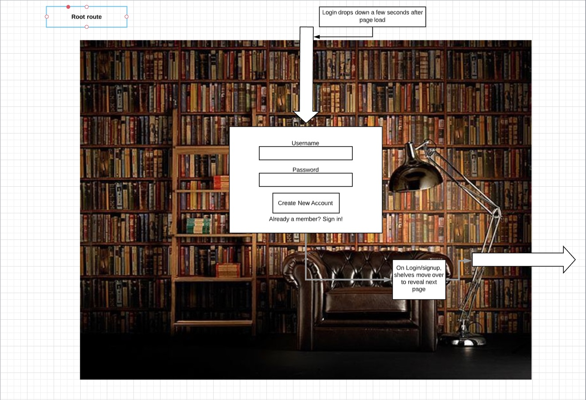
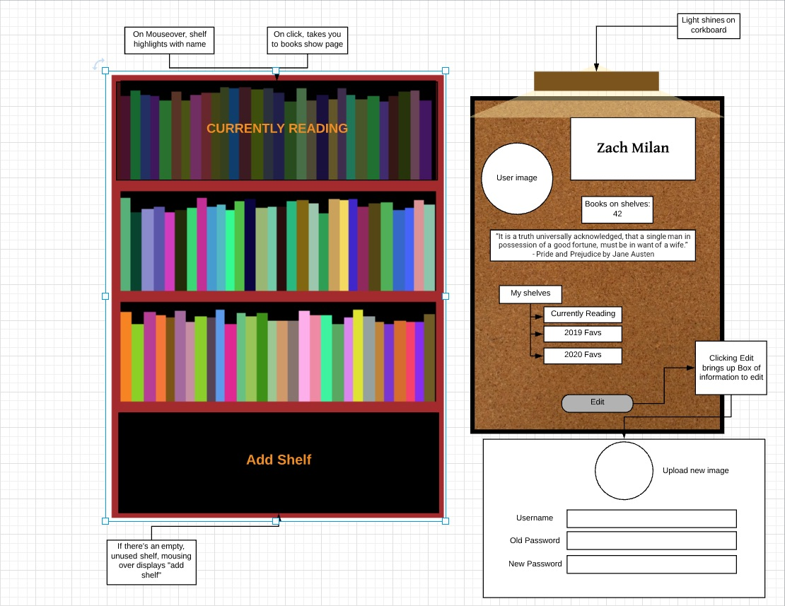
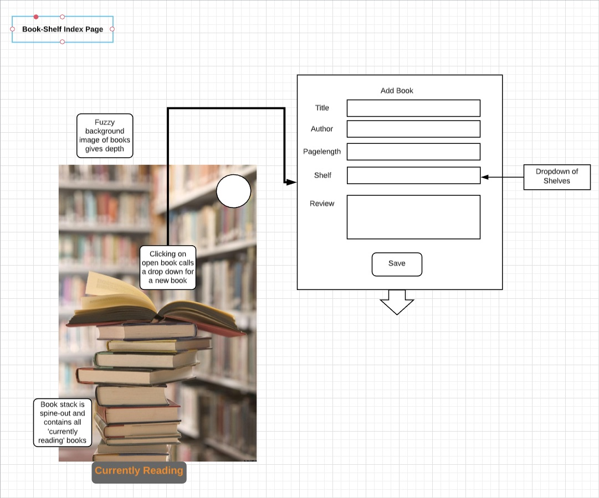
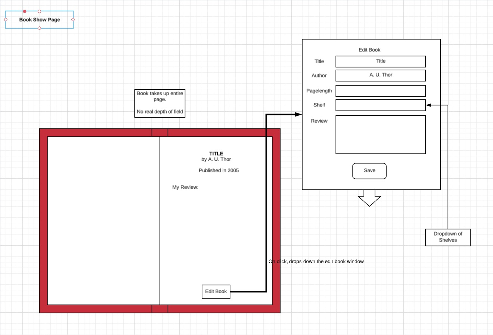
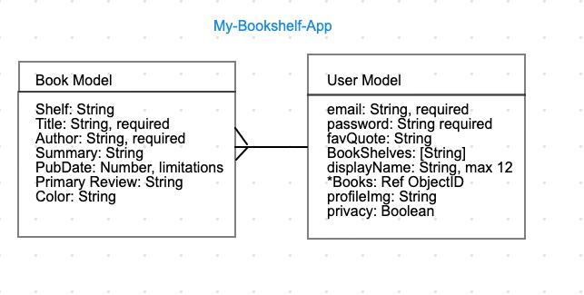

# My-Bookshelf App: User Stories
Elevator Pitch: An application where users can create bookshelves storing information about their favorite books (or books currently reading).  Read reviews they have submitted for each book and see other users saved bookshelves. 

## Site Design
### Root Page
User arrives at root page and sees images of a private library, a drop down menu appears requesting a login or to sign up.  Once logged in, the page wipes to the left revealing the user show page.

### User Show Page
User can see their profile image and other information displayed on a corkboard.  They can see the shelves that they have created on a Bookshelf.  They can click on the shelf and be taken to the book-shelf index page.

### Book-Shelf Index Page
The User will find a stack of books in front of a fuzzy out of focus background (giving depth).  These books are their books that they can add and remove.  Each book you can click on and be brought to the ...
 

### Book Show Page
User will see the inside of an open book
 

### Edit/Add Windows
Upon clicking ‘add book,’ ‘edit book,’ ‘new shelf,’ or ‘edit shelf’, a window drops down from above to allow user to input information and save
### Site Design Aesthetic
Warm palette, browns and such.
Feels like you’re inside a ‘personal library’
All UI should feel ‘real’ as possible
Click on reading glasses to search
Hovering over a book “pulls it out” a bit
Utilizes dropdowns for Add/Edit
Light design calls attention to proper areas

## Models

### CRUD
#### For Books
* Add (create) book from user input (Stretch: Goodreads Search)
* Read books on shelf/stack, show contents
* Update reviews
* Delete books from shelf
#### For Shelves
* Add (create) and name shelves
* Read Shelves in user page
* Update Shelf name
* Delete entire shelf
#### For Users
* Add user from base page
* Read user on user page
* Update user info/password/image
* Delete user instance

## Dependencies Installed
* express
* express-session
* connect-mongo
* mongoose
* bcryptjs
* dotenv
* method-override
* multer
* axios
* xml2js

## Technologies
* Frontend - HTML, CSS, JS
* Backend - Mongoose, MongoDB Express, Node.js, Multer
* Auth - bcrypt

## Schedule:
**Delegation:**
* Pair programming planned for all stages
* Any evening time allows for extra programming, pull request in the morning

**Friday** (Initiating project)
* Planning
* Start Hardcoded HTML, CSS
* Repo w/ MVC Initial File Structure (The stuff we know we need)

**Sunday** (Bonus day)
* Implement hardcoded site design
* Database Models
* Hardcoded data (3-5 books, 1 user, 2 shelves)

**Monday**
* Morning - beautify site design
* Afternoon - Routes/functionality

**Tuesday?** (User)
* Finish routes and functionality
* Authentication setup (Stretch Goal)

**Wednesday** (Stretch day)
* Plumb in API
* Stretch Goals
* Any additional styling

**Thursday** (finesse day)
* Edge cases
* POLISH POLISH POLISH day
* Hook into Heroku @ 4pm PST

## Stretch Goals
*Feasibility measured 1-10, impossible to easily implemented*

* API goodreads reviews
*Feasibility: 6 Goodreads API exists, but needs dev key. Doesn’t need OAuth for simple requests.*

* User authentication
*Feasibility: 8 Provided Kenny’s lesson, this should happen*

* Searching goodreads API and adding a book from there
*Feasibility: 6 Goodreads API exists, but needs dev key. Doesn’t need OAuth for simple requests.*

* User-to-User Interactions (Index page, see their bookshelves)
*Feasibility: 6 With a user database needed for Authentication, much of the structure will already be in place. But figuring out how to provide this functionality (friends list?) requires more planning.*

* Tying Goodreads user accounts into their bookshelf account
*Feasibility: 3 Goodreads API exists, but we’d need OAuth for this. We’d also need to figure out what data to call/grab/show.*

### Bonus List (fun to have)
* Lamp flickers on when you arrive on the site
* Corkboard lighting/features
* User content such as favorite quotes, images, links to appear on corkboard.
